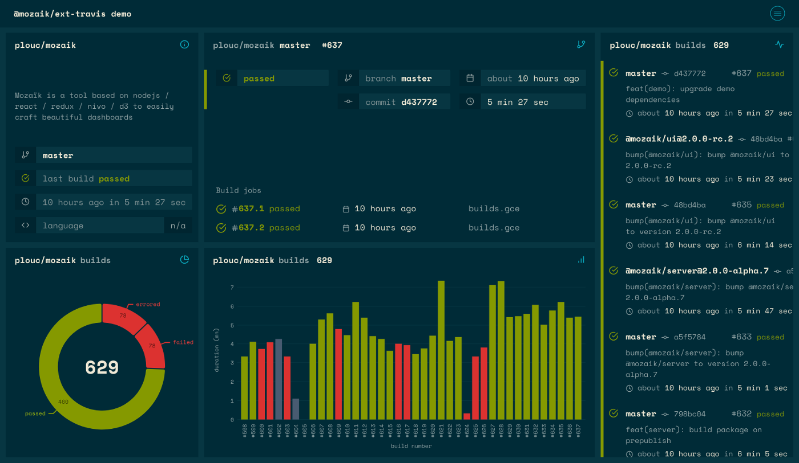
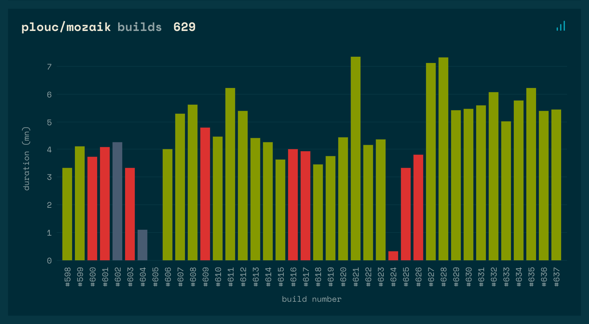
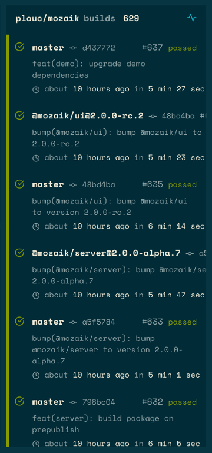
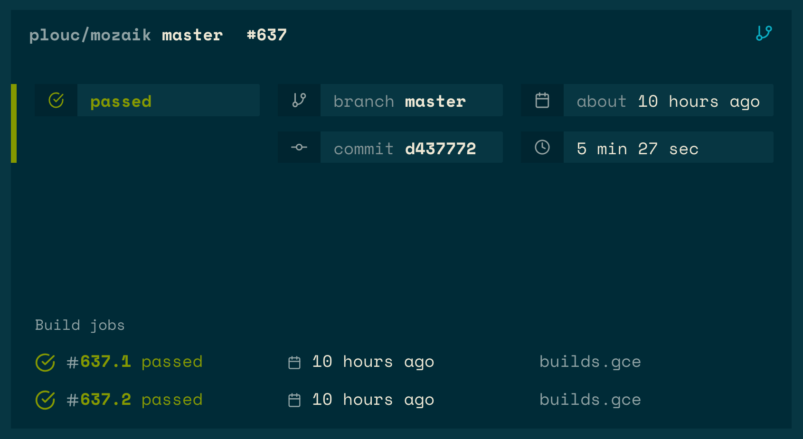
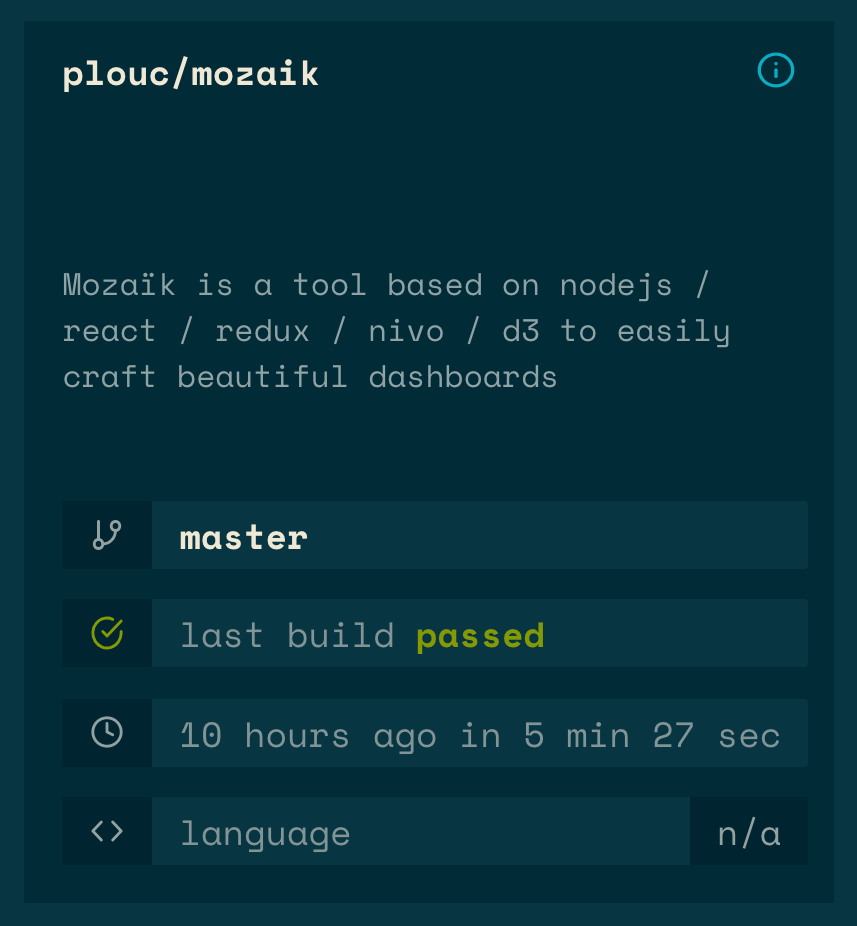
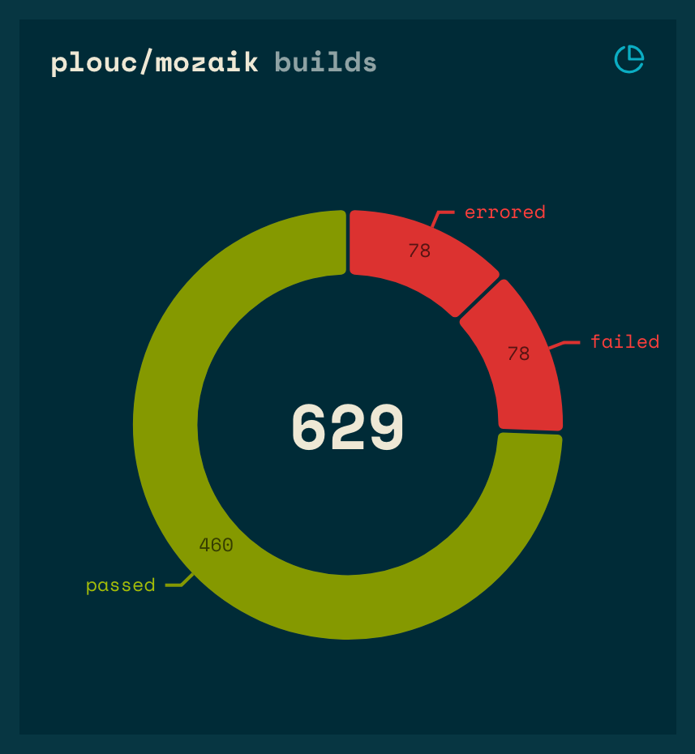

# Mozaïk travis widgets

[![License][license-image]][license-url]
[![Travis CI][travis-image]][travis-url]
[![NPM version][npm-image]][npm-url]
[![Coverage Status][coveralls-image]][coveralls-url]
![widget count][widget-count-image]



- [installation](#install)
- [client configuration](#client-configuration)
- [widgets](#widgets)
    - [BuildHistogram](#buildhistogram)
    - [BuildHistory](#buildhistory)
    - [LatestRepositoryBuild](#latestrepositorybuild)
    - [Repository](#repository)
    - [RepositoryBuildsStats](#repositorybuildsstats)

> This branch contains code for the version compatible with
> Mozaïk v2, if you're looking for v1, please use
> [mozaik-1 branch](https://github.com/plouc/mozaik-ext-travis/tree/mozaik-1).

## Demo

You can see a live demo of the widgets [here](https://mozaik-ext-travis-v2.herokuapp.com/)

## Install

### Install extension:

```sh
# npm
npm install -S @mozaik/ext-travis
# yarn
yarn add @mozaik/ext-travis
```

### Register client api

You should register extension's client by adding this to `apis.js`:

```javascript
// …
Mozaik.registerApi('travis', require('@mozaik/ext-travis/client'))
```

### Register widgets

You should register extension's widget by adding this to `src/register_extensions.js`:

```javascript
import { Registry } from '@mozaik/ui'
import travis from '@mozaik/ext-travis'
// … 
Registry.addExtensions({
    travis,
})
```

## Client Configuration

In order to use the Mozaïk travis extension, you must also configure its **client**.
Configuration is loaded from environment variables.

| env key          | required | description
|------------------|----------|----------------------------
| TRAVIS_API_TOKEN | yes      | your personal travis API token

## Widgets

### BuildHistogram



> Display travis repo build histogram (duration / build number / status)

#### parameters

key          | required | description
-------------|----------|---------------
`owner`      | yes      | repo owner
`repository` | yes      | repo name
`limit`      | no       | limit displayed builds, default to `20`
`title`      | no       | override default title, default to `${owner}/${repository} builds`

#### usage

``` yaml
- extension:  travis
  widget:     BuildHistogram
  owner:      plouc
  repository: mozaik
  columns:    1
  rows:       1
  x:          0
  y:          0
```

### BuildHistory



> Display travis repo build history

#### parameters

key          | required | description
-------------|----------|---------------
`owner`      | yes      | *repo owner*
`repository` | yes      | *repo name*
`limit`      | no       | limit displayed builds, default to `10`
`title`      | no       | override default title, default to `${owner}/${repository} builds`

#### usage

``` yaml
- extension:  travis
  widget:     BuildHistory
  owner:      plouc
  repository: mozaik
  columns:    1
  rows:       1
  x:          0
  y:          0
```

### LatestRepositoryBuild



> Show info about latest repository build for default branch

#### parameters

key          | required | description
-------------|----------|---------------
`owner`      | yes      | repo owner
`repository` | yes      | repo name

``` yaml
- extension:  travis
  widget:     LatestRepositoryBuild
  owner:      plouc
  repository: mozaik
  columns:    1
  rows:       1
  x:          0
  y:          0
```

### Repository



> Display travis repository info

#### parameters

key          | required | description
-------------|----------|---------------
`owner`      | yes      | repo owner
`repository` | yes      | repo name
`title`      | no       | override default title, default to `${owner}/${repository}`

#### usage

``` yaml
- extension:  travis
  widget:     Repository
  owner:      plouc
  repository: mozaik
  columns:    1
  rows:       1
  x:          0
  y:          0
```

### RepositoryBuildsStats



> Show global stats about repository builds

#### parameters

key          | required | description
-------------|----------|---------------
`owner`      | yes      | *repo owner*
`repository` | yes      | *repo name*
`title`      | no       | override default title, default to `${owner}/${repository} builds`

#### usage

``` yaml
- extension:  travis
  widget:     RepositoryBuildsStats
  owner:      plouc
  repository: mozaik
  columns:    1
  rows:       1
  x:          0
  y:          0
```


[license-image]: https://img.shields.io/github/license/plouc/mozaik-ext-travis.svg?style=flat-square
[license-url]: https://github.com/plouc/mozaik-ext-travis/blob/master/LICENSE.md
[travis-image]: https://img.shields.io/travis/plouc/mozaik-ext-travis.svg?style=flat-square
[travis-url]: https://travis-ci.org/plouc/mozaik-ext-travis
[npm-image]: https://img.shields.io/npm/v/@mozaik/ext-travis.svg?style=flat-square
[npm-url]: https://www.npmjs.com/package/@mozaik/ext-travis
[coveralls-image]: https://img.shields.io/coveralls/plouc/mozaik-ext-travis/master.svg?style=flat-square
[coveralls-url]: https://coveralls.io/github/plouc/mozaik-ext-travis?branch=master
[widget-count-image]: https://img.shields.io/badge/widgets-x5-green.svg?style=flat-square
